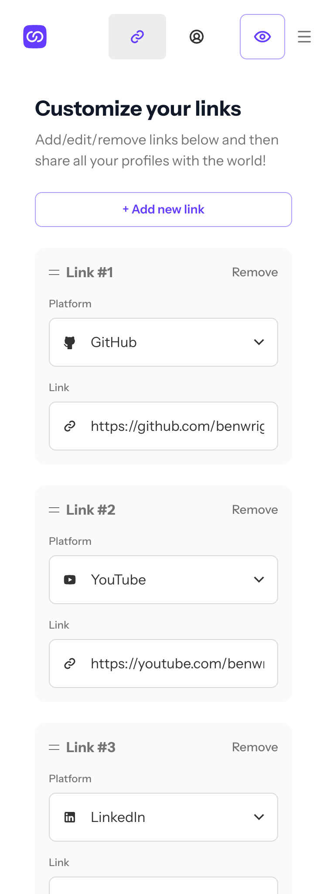
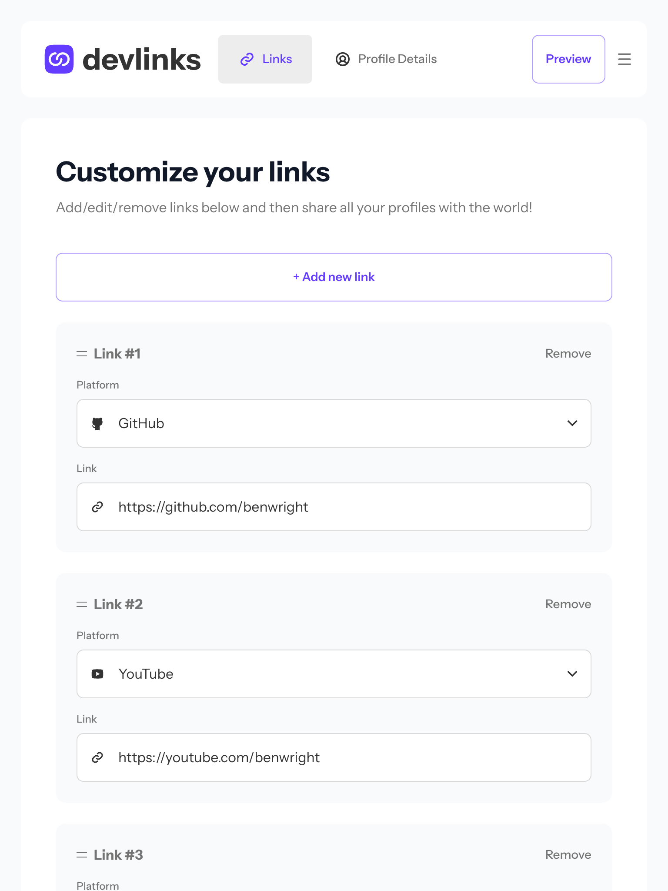
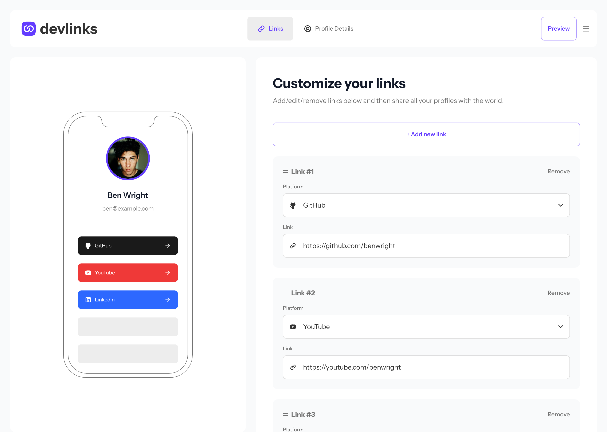
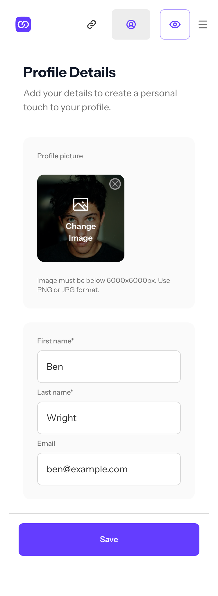
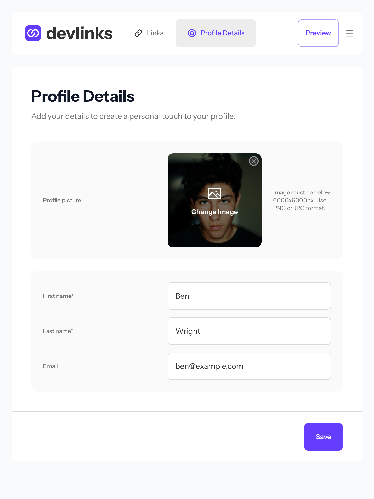
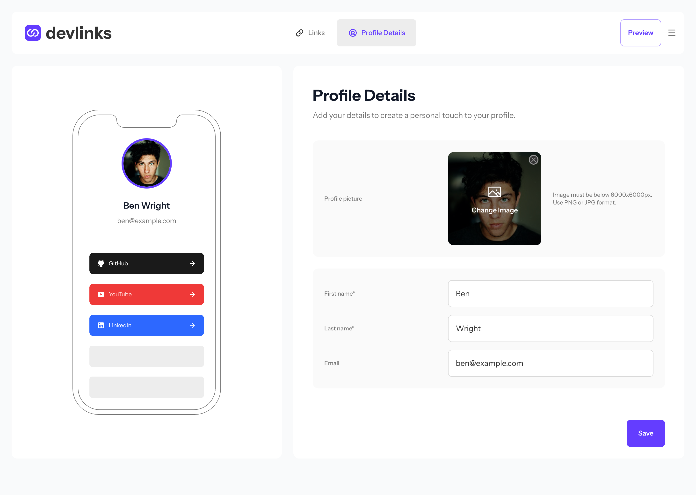
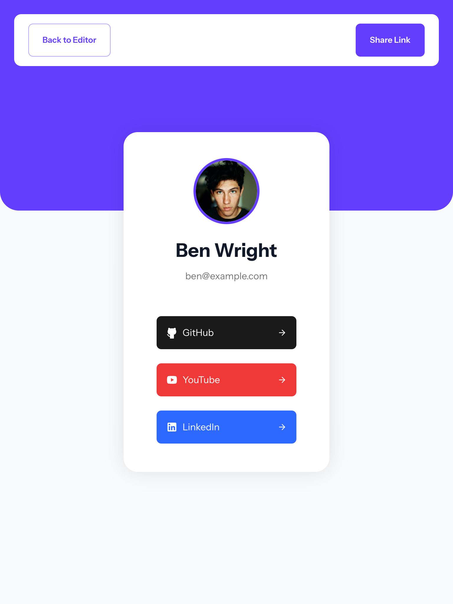
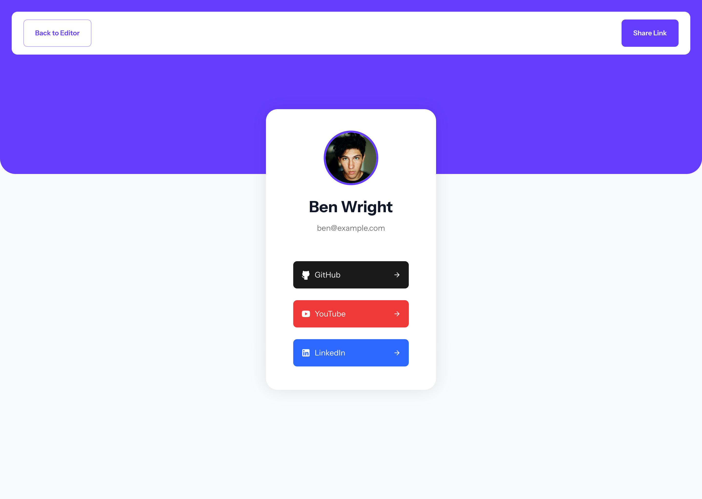

# Frontend Mentor - Link-Sharing App

This is a solution to the [Link-sharing app challenge on Frontend Mentor](https://www.frontendmentor.io/challenges/linksharing-app-Fbt7yweGsT). Frontend Mentor challenges help you improve your coding skills by building realistic projects.

## Table of contents

- [Overview](#overview)
  - [The challenge](#the-challenge)
  - [Screenshots](#screenshots)
  - [Links](#links)
- [My process](#my-process)
  - [Built with](#built-with)
  - [What I learned](#what-i-learned)
  - [Continued development](#continued-development)
  - [Useful resources](#useful-resources)
- [Author](#author)
- [Acknowledgments](#acknowledgments)

## Overview

### The challenge

Users should be able to:

- Create, read, update, delete links and see previews in the mobile mockup
- Receive validations if the links form is submitted without a URL or with the wrong URL pattern for the platform
- Drag and drop links to reorder them
- Add profile details like profile picture, first name, last name, and email
- Receive validations if the profile details form is saved with no first or last name
- Preview their devlinks profile and copy the link to their clipboard
- View the optimal layout for the interface depending on their device's screen size
- See hover and focus states for all interactive elements on the page
- **Bonus**: Save details to a database (build the project as a full-stack app)
- **Bonus**: Create an account and log in (add user authentication to the full-stack app)

### Screenshots

|                Mobile designed at 375px:                |               Tablet designed at 1440px:                | Desktop designed at 1440px:                              |
| :-----------------------------------------------------: | :-----------------------------------------------------: | -------------------------------------------------------- |
|    |    |    |
|  |  |  |
|         |         |         |

### Links

- Solution URL: [https://github.com/elisilk/link-sharing-app](https://github.com/elisilk/link-sharing-app)
- Live Site URL: [https://link-sharing-app-eight-nu.vercel.app/](https://link-sharing-app-eight-nu.vercel.app/)

## My process

### Built with

- [GitHub](https://github.com/) - code repository
- [Nuxt](https://nuxt.com/) - full-stack web framework (built on Vue, Vite, and Nitro)
- [Vercel](https://vercel.com/docs/getting-started-with-vercel) - web host deployment
- [Vercel Blob](https://vercel.com/docs/vercel-blob) - storage (for the profile picture images)
- [Nuxt UI](https://ui.nuxt.com/) - UI component library (built on Tailwind and Reka UI)
  - [Lucide icons](https://icon-sets.iconify.design/lucide/?keyword=lucide)
  - [VueUse useSortable](https://vueuse.org/integrations/useSortable/) - based on [sortable.js](https://github.com/SortableJS/Sortable)
- [Nuxt Auth Utils](https://github.com/Atinux/nuxt-auth-utils) - user authentication
- [Drizzle](https://orm.drizzle.team/) - ORM library
- [Turso](https://turso.tech/) - database

Other libraries I made use of, primarily for the workflow setup:

- [Husky](https://github.com/typicode/husky)
- [Concurrently](https://github.com/open-cli-tools/concurrently)
- [Lint-staged](https://github.com/lint-staged/lint-staged)
- [ESLint](https://eslint.org/)
  - [Nuxt ESLint](https://eslint.nuxt.com/)
  - [Anthony Fu's ESLint config preset](https://github.com/antfu/eslint-config)

### What I learned

As always, so many cool :sunglasses: things. Here are some of the key resources I used.

#### Database

[My database schema](https://mermaid.ai/d/c1808b67-d215-4c2e-8ed1-f856fbcdebc9)

To update/reset the database locally (development):

- delete the ~/server/db/migrations folder
- delete each of the ~/local.db\* files
- update the schema files in ~/server/db/schema/
- run `pnpm drizzle-kit generate` to regenerate the migration files
- run `pnpm drizzle-kit migrate` to apply the generated SQL migration files to the database

To update/reset the database on Turso (production):

- do all of the above first on the local/development environment
- **may have to go online to the Turso database and delete the existing rows and tables**
- change the `.env` to the production version
- run `pnpm drizzle-kit push` (the same two commands as above)
- change the `.env` back to the development version

See: [Migrations with Drizzle Kit](https://orm.drizzle.team/docs/kit-overview)

#### Building the App

- [Full Stack App Build | Travel Log w/ Nuxt, Vue, Better Auth, Drizzle, Tailwind, DaisyUI, MapLibre](https://www.youtube.com/watch?v=DK93dqmJJYg) - I learned so much from watching and following along with this video. I adopted/adapted much the same approach and tech stack. Thanks, CJ!
- [Nuxt Auth Utils: Secure, Simple, and Flexible Logins](https://vueschool.io/courses/nuxt-auth-utils-secure-simple-and-flexible-logins) - I learned a ton from this video course too, and an [associated blog post](https://vueschool.io/articles/vuejs-tutorials/email-password-logins-with-nuxt-auth-utils-and-nuxt-ui/). Among other things, helped me to realize that I preferred using Nuxt UI rather than DaisyUI. Thank you, Daniel!
- [File Uploads in Vue.js](https://vueschool.io/courses/file-uploads-in-vue-js) - This video course and [associated blog post](https://vueschool.io/articles/vuejs-tutorials/handling-file-uploads-in-nuxt-with-usestorage/) led me to using [unstorage](https://unstorage.unjs.io/guide) with Vercel Blob storage to store the profile picture files.
  - [Store files and K/Vs in Nuxt and Nitro - Powered by unstorage](https://www.youtube.com/watch?v=iE67C7ldjEk&t=49s)
  - [unstorage - Vercel driver](https://unstorage.unjs.io/drivers/vercel)
  - [unstorage - feat: raw data support (experimental)](https://github.com/unjs/unstorage/pull/141) - I had some issues using the [`getItemRaw()` function](https://unstorage.unjs.io/guide#getitemrawkey-opts), which is experimental, and so had to abandon that for now. But I hope to come back to it at some point, because it is so nice to have such a nice, simple solution built in to Nuxt.
- [The Vue Form Component Pattern: Robust Forms Without the Fuss](https://vueschool.io/articles/vuejs-tutorials/the-vue-form-component-pattern-robust-forms-without-the-fuss/) - A great, reusable component to maintain a local copy of form data rather than directly binding to the state data, so that updates are only visisble to the user upon hitting the save button.

#### Testing the App

### Continued development

Known issues - specific areas that the solution should be improved:

- [x] When viewing the page on a mobile device, the page zooms in automatically when going into an input field. That behavior is fine, but the issue is more when the form is submitted and the user is navigated to the next page, it seems to maintain that zoom instead of resetting fully to the original zoom of the page. How to fix? Hmm 🤔
  - Solved: had to just change the font size of the inputs to 16px
  - [Google search: "nuxt mobile zoom out to full page on navigation to new page"](https://www.google.com/search?q=nuxt+mobile+zoom+out+to+full+page+on+navigation+to+new+page)
  - [Disable Auto Zoom in Input "Text" tag - Safari on iPhone](https://stackoverflow.com/questions/2989263/disable-auto-zoom-in-input-text-tag-safari-on-iphone)
- [ ] Remove the extra unneccsary vertical scrolling in the large viewport due to the height of the `aside` container calculating its height incorrectly. It likely has something to do with the [`--ui-header-height` CSS variable](https://ui.nuxt.com/docs/getting-started/theme/css-variables#header).
- [ ] Warning message that occurs on Chrome when opening up the toggled navigation menu from the header: "Blocked aria-hidden on an element because its descendant retained focus". The issue doesn't seem to arise on Firefox so far.
- [ ] Issue with the [`getItemRaw()` unstorage function](https://unstorage.unjs.io/guide#getitemrawkey-opts) not properly returning the image buffer when called in the picture uploads server route when using Vercel Blob.
- [ ] Vertical orientation photos uploaded as the profile picture are viewed in the incorrect orientation (as horizontal). May need to [read the EXIF data and rotate those photos](https://www.google.com/search?q=javascript+upload+photo+from+mac+photos+vertical+in+wrong+orientation).
  - [Fixing wrongly oriented iphone photos](https://medium.com/@manoj_makkuboy/fixing-wrongly-oriented-iphone-photos-f6375d32ef73)
- [ ] improve the page header flex items as transition to a smaller viewport/container width so that the crowding is minimized and the left/logo side doesn't take up disproportionate space
- [x] improve the hover/active/focus state of the image upload input
- [ ] improve the design of the toast components so it better matches the design

Feature requests - specific enhancements to make:

- [x] Ability to delete the current profile picture without having to replace it with a new one
- [x] Method for updating login info (email and password)
- [ ] Method for retrieving/changing a forgotten password
  - [Password reset links in Nuxt](https://v2.lucia-auth.com/guidebook/password-reset-link/nuxt/) - although a different framework, this seems like a good model for the steps that are needed.
  - [Google "nuxt auth utils forgot password"](https://www.google.com/search?q=nuxt+auth+utils+forgot+password)
- [ ] Method for deleting an account
- [ ] [Next level security features to prevent brute force attacks](https://vueschool.io/lessons/next-level-security-features-attempt-locks-to-prevent-brute-force-attacks)
- [x] [Protection of sensitive data in API routes with requireUserSession](https://vueschool.io/lessons/protect-sensitive-data-in-api-routes-with-requireusersession)
- [ ] [Optimistic updates](https://nuxt.com/docs/4.x/api/composables/use-nuxt-data#optimistic-updates)
- [ ] Disable form buttons and inputs after submission until the server action is completed; show loading state
- [ ] Make sure all tabbable elements have a clear focused state (e.g., with outlines)
- [ ] If make changes in the editor and try to navigate away without saving them, ask to confirm before navigating away (e.g., [video marker: "show confirmation if unsaved changes in form"](https://www.youtube.com/watch?v=DK93dqmJJYg&t=11693s))

More general ideas to consider:

Hmm 🤔 ...

### Useful resources

Hmm 🤔 ...

## Author

- Website - [Eli Silk](https://github.com/elisilk)
- Frontend Mentor - [@elisilk](https://www.frontendmentor.io/profile/elisilk)
