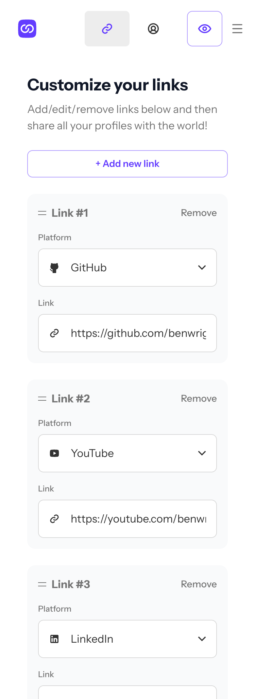
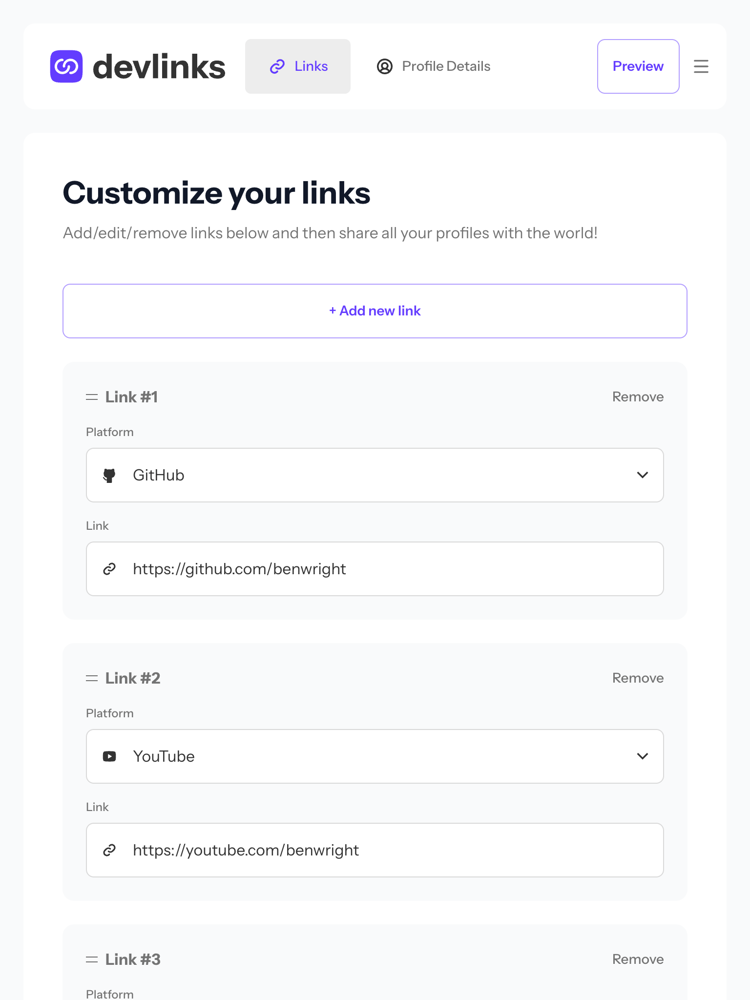
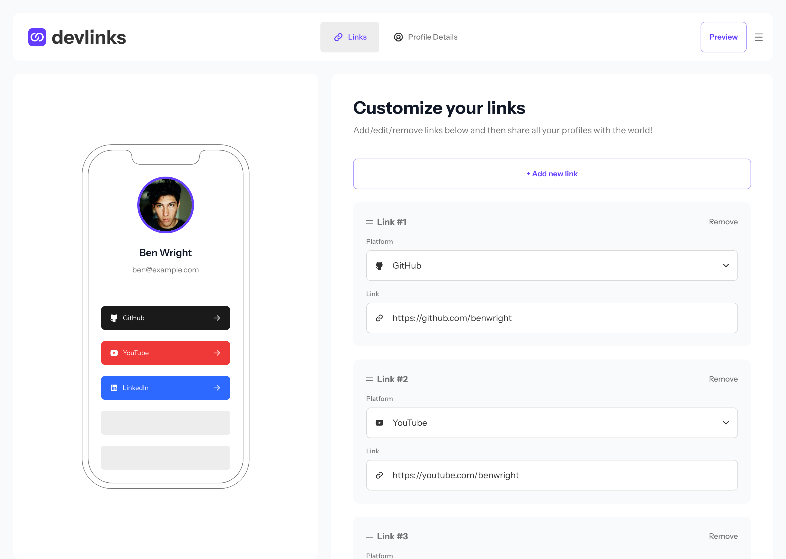
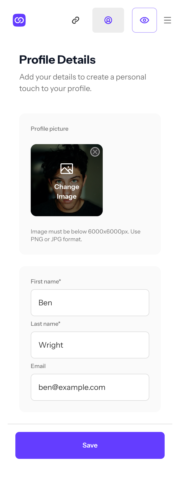
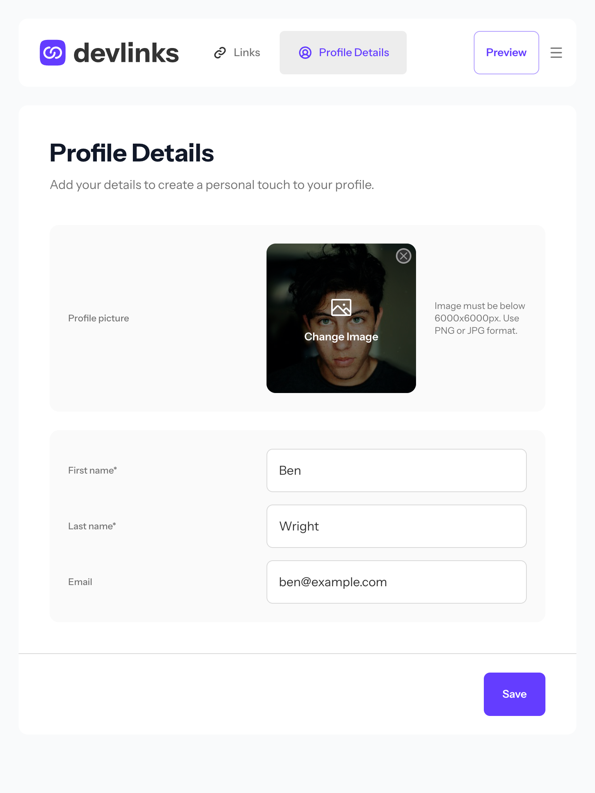
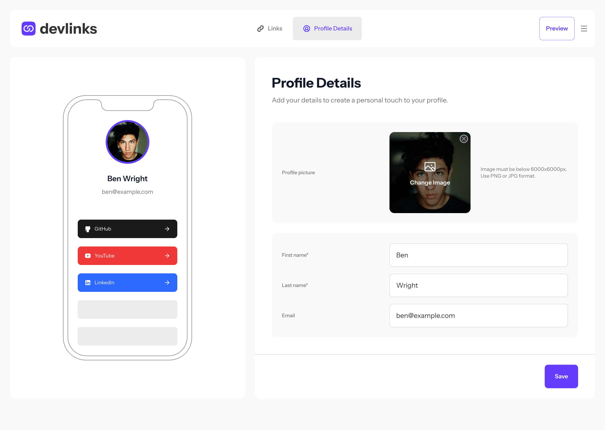
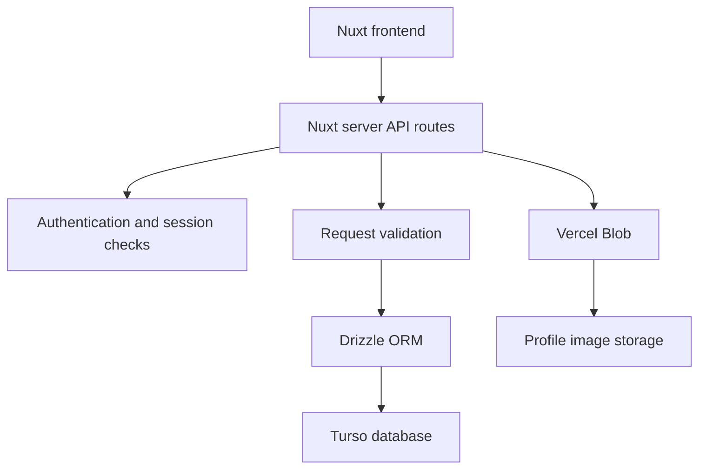

# Devlinks

A full-stack link-sharing application built with **Nuxt, TypeScript, Drizzle, Turso, and Vercel Blob**.

Devlinks allows users to create and manage a personal profile, add and reorder links, upload a profile image, and share their profile through a public-facing page. The project began as a [Frontend Mentor](https://www.frontendmentor.io/) challenge and was extended to explore authentication, server-side API development, relational data modeling, and object storage.

**[Live Demo](https://devlinks-site.vercel.app/)** · **[Frontend Mentor Solution](https://www.frontendmentor.io/solutions/full-stack-link-sharing-app-using-nuxt-gdxUVblWay)**

## Demo Account

Visitors are welcome to register a new account with their own chosen credentials in order to explore the live application. If you would prefer not to register a new account, I've included a demonstration account for exploring the authenticated editor.

**Demo credentials**

* **Email:** `ben@example.com`
* **Password:** `demopassword`

To explore the authenticated experience:

1. Open the [live demo](https://devlinks-site.vercel.app/).
1. Sign in using the demonstration credentials.
1. Explore and update the profile links and details.
1. Preview the resulting shareable profile.

The public profile for this demo account is viewable without logging in at:

[View demo public profile](https://devlinks-site.vercel.app/profile/4)

The demonstration account is intended for exploring the application. Please do not use it for personal information or change its credentials. 

## Overview

The application provides two main experiences:

- **Private editor:** Authenticated users can manage their profile information, profile image, and links.
- **Public profile:** Visitors can view a user's shareable profile and follow their published links.

The project uses Nuxt for both the frontend application and server-side API routes. Drizzle ORM and Turso provide the relational data layer, while Vercel Blob is used for profile-image storage.

The implementation goes beyond the basic frontend challenge requirements by adding user registration, authentication, database-backed profile management, server-side validation, and persistent data storage.

## Key Features

- User registration and authentication
- Private profile editor for authenticated users
- Public profile pages for sharing links
- Profile-image upload and storage
- Create, edit, delete, and reorder profile links
- Drag-and-drop link reordering
- Client-side and server-side form validation
- User-facing feedback for validation and API errors
- Responsive layouts for mobile and desktop
- Persistent relational data using Turso and Drizzle ORM

## Screenshots

|                Mobile designed at 375px:                |                Tablet designed at 768px:                | Desktop designed at 1440px:                              |
| :-----------------------------------------------------: | :-----------------------------------------------------: | -------------------------------------------------------- |
|    |    |    |
|  |  |  |
|         |         |         |

## Application Architecture

The application separates authentication data from the public profile information associated with an account.

A user account represents the identity used for authentication, while a related profile contains the information intended to be displayed publicly. Links belong to the profile and can be managed through the authenticated editor.

The main application flow is:


```mermaid
flowchart TD
    A[Nuxt frontend] --> B[Nuxt server API routes]
    B --> C[Authentication and session checks]
    B --> D[Request validation]
    D --> E[Drizzle ORM]
    E --> F[Turso database]
    B --> G[Vercel Blob]
    G --> H[Profile image storage]
```

### Authentication and identity

Authentication is handled through Nuxt Auth Utils. Protected pages and server operations check the authenticated session before allowing access to user-specific data or modifications.

The separation between the user account and the public profile allows authentication-related information to remain distinct from information intended for public sharing.

The account email and public profile contact email are currently stored as separate fields. Email verification and additional coordination between these fields have not yet been implemented.

### Database and relationships

The relational database stores user accounts, profiles, and profile links. Drizzle ORM provides the schema and database access layer, while Turso provides the SQLite-compatible database service.

The application uses database relationships to associate profiles and links with the appropriate account. Server-side operations use the authenticated user's identity when accessing or modifying user-specific data rather than relying on client-provided identity information alone.

### Profile-image storage

Profile images are stored using Vercel Blob rather than directly in the relational database.

The database stores the information needed to associate an uploaded image with the user's profile, while the image file itself is handled by the object-storage service.

## API Routes and Server-Side Operations

Nuxt server API routes provide the boundary between the client application and the application's data services.

The server layer handles operations such as:

- Registering users and creating associated profile data
- Retrieving and updating profile information
- Creating, updating, deleting, and reordering links
- Managing profile-image uploads
- Checking authentication before protected operations
- Validating incoming request data
- Returning errors from failed operations

Keeping these operations on the server allows database and storage credentials to remain outside the client application and gives the server responsibility for enforcing access to user-specific data.

## Validation and Error Handling

The application uses validation at both the client and server levels.

Client-side validation provides immediate feedback while users complete forms. Server-side validation independently checks incoming data before it is used in database or storage operations, rather than relying on the client to enforce application rules.

The application uses thrown API errors for failed server operations and distinguishes expected application errors from unexpected failures. For example, a profile update that conflicts with an existing unique email address can return a specific error that the frontend translates into an actionable message.

Errors are surfaced through user-facing feedback, including toast notifications, so users receive information when an operation cannot be completed.

This layered approach helps keep the interface responsive while maintaining validation and authorization responsibilities on the server.

## Accessibility and Responsive Design

The application was developed with responsive behavior and keyboard interaction in mind.

The editor includes interactive controls for managing profile links, including drag-and-drop reordering. The interface also provides keyboard-accessible alternatives for interacting with the relevant controls.

Responsive layouts support the editor and public profile experience across mobile and desktop viewport sizes.

Accessibility and responsive behavior were considered during implementation, although the project has not yet gone through a comprehensive, documented cross-browser and assistive-technology testing process.

## Development Workflow

The project uses:

- **Nuxt / Vue** — application framework
- **TypeScript** — static typing
- **Nuxt Auth Utils** — authentication and session management
- **Drizzle ORM** — database schema and queries
- **Turso** — relational database
- **Vercel Blob** — profile-image storage
- **Zod** — validation
- **Vite** — development and build tooling
- **ESLint** — linting
- **Husky and lint-staged** — pre-commit checks
- **GitHub Actions** — automated linting workflow
- **Vercel** — deployment

The repository includes database migration configuration and generated migration files. Linting and selected checks are integrated into the development workflow to catch issues before changes are committed or deployed.

Development is organized using Git feature branches and pull requests. Completed changes are merged into the main branch.

## Testing

Automated tests have not yet been added to this project.

Manual testing was used during development, including testing forms, authentication flows, profile editing, link management, responsive layouts, and interactive editor functionality.

Adding automated tests for server endpoints, authentication-related behavior, and important UI interactions would be a logical next step.

## Known Limitations

The project remains a learning and development project, with several areas that could be extended:

- Automated tests for server endpoints and key user flows
- Guest-to-registered account conversion
- Email verification for account and public contact email addresses
- Password reset and additional account-management functionality
- Account deletion
- Additional protection against repeated or abusive requests
- Further refinement of unsaved-form navigation and user feedback
- More comprehensive cross-browser and assistive-technology testing

These limitations reflect areas for continued development rather than functionality represented as already complete.

## Local Development

### Requirements

- Node.js
- pnpm
- A configured Turso database
- A configured Vercel Blob storage environment
- The required authentication and application environment variables

### Install dependencies

```bash
pnpm install
```

### Configure environment variables

Create the appropriate local environment configuration with the credentials and settings required by the application.

Refer to the repository's environment configuration and server setup for the variables used by the database, authentication, and object-storage integrations.

### Run the development server

```bash
pnpm dev
```

The application will be available at the local development URL shown by Nuxt.

### Database migrations

The project uses Drizzle migrations to manage database schema changes.

Use the repository's configured Drizzle commands to generate and apply migrations in the appropriate environment. Avoid applying destructive database operations to a production database without first reviewing the migration and confirming the target environment.

## Credits

- Interface design provided by [Frontend Mentor](https://www.frontendmentor.io/).
- Authentication supported by [Nuxt Auth Utils](https://github.com/atinux/nuxt-auth-utils).
- Database access provided by [Drizzle ORM](https://orm.drizzle.team/).
- Database service provided by [Turso](https://turso.tech/).
- Profile-image storage provided by [Vercel Blob](https://vercel.com/docs/storage/vercel-blob).

## Author

**Eli M. Silk**

- [GitHub](https://github.com/elisilk)
- [Frontend Mentor](https://www.frontendmentor.io/profile/elisilk)
